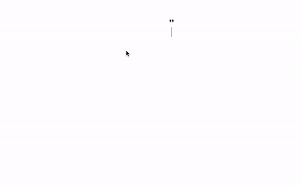

# EditorJS Quote Block

Provides a wider range of style-type quote blocks.

## Preview



## Installation

Get the package:

```bash
yarn add @cychann/editorjs-quote
```

Include module in your application:

```javascript
import Quote from "@cychann/editorjs-quote";
```

## Usage

Add a new Tool to the tools property of the Editor.js initial config.

```javascript
const editor = new EditorJS({
  holder: "editor",
  tools: {
    quote: {
      class: Quote,
      config: {
        defaultType: "quotationMark",
      },
      shortcut: "CMD+SHIFT+O",
    },
  },
});
```

### Configuration Options

- **defaultType**: The default type of the quote block. Possible values are:
  - `quotationMark`: Uses the quotation mark icon. (Default)
  - `verticalLine`: Uses a vertical line style.
  - `boxed`: Uses a boxed style.
